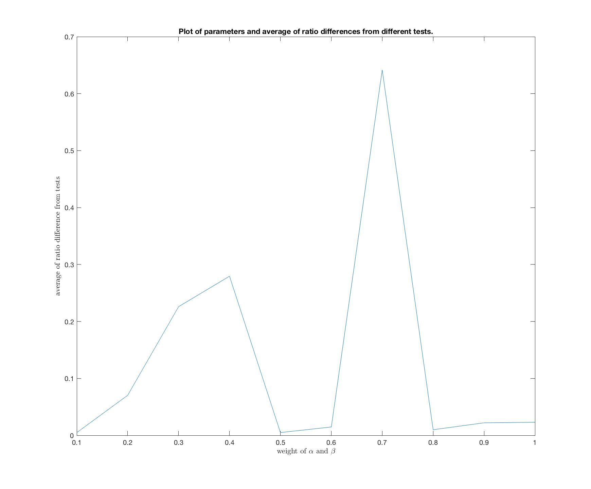
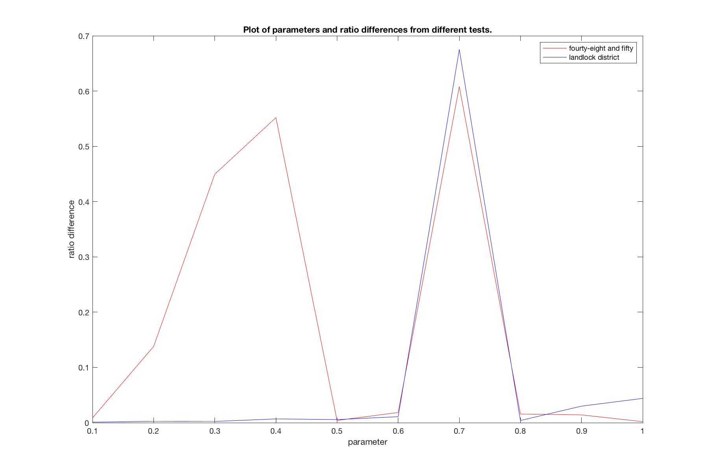
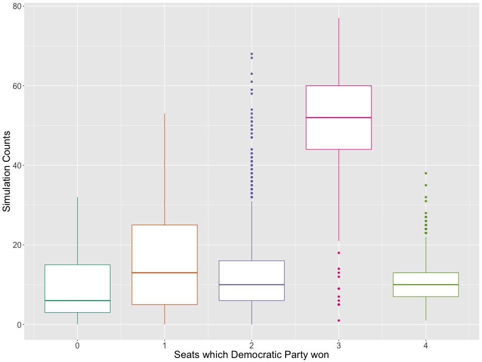

# WXML-18wi-Research

<ul id="top">
  <li><a href="#top">Overview</a></li>
  <li><a href="#Phase-1">Phase 1</a></li>
  <li><a href="#Phase-2">Phase 2</a></li>
  <li><a href="#Phase-3">Phase 3</a></li>
  <li><a href="#Phase-4">Phase 4</a></li>
</ul>

This repository contains source code for <a href="http://wxml.math.washington.edu/">Washington Experimental Mathematics Lab</a>'s Winter 2018 Research Program: <u>Mathematics of Gerrymandering</u>, at the University of Washington.<br />

<h2>Members</h2>
Faculty Mentor: Christopher Hoffman (Math)<br />
Graduate Mentor: Tejas Devanur<br />
Team Members: Leo Segovia, Alexander Robkin, Weifan Jiang, Namyoung Kim

<h2>Project Discription</h2>
Districting and Gerrymandering have been in the news a lot recently, and the mathematical modeling of how to draw districts is a very hot topic. This project will look at the space of all possible redistrictings of a state to see whether the current plan is an outlier. It will involve probability and computing skills.

<hr />

<h2 id="Phase-1">Phase 1: Metropolis Algorithm & Ising Model</h2>

This portion contains specifications of first phase of project - implementing <b>Metropolis Algortihm</b> and <b>Ising Model</b> in Python, which can be used to simulate a <i>random sample</i> on an input $n$ by $m$ grid-shaped graph.

<h2>Input of program</h2>

* <code>int</code> $n$: height of input 2D grid.
* <code>int</code> $m$: width of input 2D grid.
* <code>int</code> $\beta$: constant used for calculating
* <code>int</code> $N$: length of random walk chain

<h2>Constructs the larger graph</h2>

Let $G = \big\{V, E\big\}$ be the initial input graph.<br />
Suppose each vertex $v \in V$ has two possible states: $\big\{-1, 1\big\}$, we would like to construct a much larger graph $\tilde{G} = \big\{\tilde{V}, \tilde{E}\big\}$ such that:
* Each $\tilde{v} \in \tilde{V}$ represents a possible state of graph $G$. Since $G$ has $n \times m$ vertices and each vertex has 2 possibilities, <code>size(</code>$\tilde{V}$<code>) = </code>$2^{mn}$.
* Each $\tilde{e} \in \tilde{E}$ connects two vertices in $\tilde{V}$ if the two vertices only <b>differ by 1 state</b>.
* We would also like to compute a <b>probability vector</b> for $\tilde{G}$, which can be computed with methods of <b>Ising Model</b>:
    * First, we compute the unweighted value, $\hat{f_{\beta}}(\tilde{v})$ for each $\tilde{v} \in \tilde{V}$. Since each $\tilde{v}$ represents a unique state of $G$ (which just means a way to assign $1$ and $-1$ to each vertex in $G$).<br />
    Let $f(v)$ represent the value assigned to $v \in V$, within some $\tilde{v}$, we can compute the unweighted probability with:<br />
    $\ln(\hat{f_{\beta}}(\tilde{v})) = \beta\sum_{(v_1, v_2) \in E)}f(v_1) \cdot f(v_2)$.
    * Now, we compute the weighted value. Since we want the probability of every $\tilde{v} \in \tilde{V}$ to sum to $1$, we compute the sum of all probabilities of each $\tilde{v}$:<br />
    $C = \sum_{\tilde{v} \in \tilde{V}} \hat{f_{\beta}}(\tilde{v})$.<br />
    Then each $\tilde{v} \in \tilde{V}$'s normalized probability value is:<br />
    $f_{\beta}(\tilde{v}) = \frac{1}{C} \cdot \hat{f_{\beta}}(\tilde{v})$.

<h2>Simulate random walk</h2>

After constructing $\tilde{G}$, we would sample from $\tilde{G}$ by ultimately selecting a vertex from $\tilde{G}$ as our sample to present (this sample represents a state of original input graph $G$, so it can mean something like which party each presinct voted for).<br />
The basic idea is that we start from a random $\tilde{v}_0 \in \tilde{V}$ at timestamp $0$, noted as $X_0 = \tilde{v}_0$.<br />
Then, we can decide to either move or stay at each timestamp. Which can be implemented by the following algorithm:

Suppose $X_i = \tilde{v}_{a}$, then at timestamp $i + 1$:
* Randomly choose a direct neighbor of $\tilde{v}_a$, say $\tilde{v}_b$ as the <code>candidate</code> of next movement.
* Decide if we make the move by using the probability vector assiciated with $\tilde{G}$ by computing the probability ratio <code>r</code>$= \frac{f_{\beta}(\tilde{v}_b)}{f_{\beta}(\tilde{v}_a)}$:
    * if <code>r >= 1</code>, accept <code>candidate</code>. In other words, $X_{i + 1} = \tilde{v}_b$.
    * if <code>r < 1</code>, then we accept <code>candidate</code> with probability <code>r</code>, and reject <code>candidate</code> with probability <code>1 - r</code>. In other words:
        * for probability <code>r</code>, $X_{i + 1} = \tilde{v}_b$.
        * for probability <code>1 - r</code>, $X_{i + 1} = X_i = \tilde{v}_a$.

Repeat this process for $N$ times until we get $X_N = \tilde{v}_N$ which $\tilde{v}_N \in \tilde{V}$ is the sample.

<h2>Graphically represent sample</h2>

After obtaining $X_N = \tilde{v}_N$, since $\tilde{v}_N$ represents a state of original input graph $G$, we can color the vertices of $G$ based on each vertex's assigned value (either $1$ or $-1$) differently. Since $G$ has the shape of 2D grid, we will ultimately show a grid with different colors, as the result of <b>phase 1</b>.

Done with phase 1!

<hr />

<h2 id="Phase-2">Phase 2: Modifying algorithm and run on Iowa data</h2>

In second phase of this project, we will update the Metropolis-Ising algorithm that we developed in Phase 1, to run on more complex shaped graph & data. Specifically:
* The input graph will shape like Iowa's precinct map
* Each node (precinct)'s state would have more possibilities (different district it may belongs to instead of $\big\{1, -1\big\}$).
* Calculate the probability ratio based on more complex conditions (namely, energies).

<h2>Make a graph class</h2>
The file <code>UdGraph.py</code> represents an undirectional graph abstract data type, which is used to model Iowa's political district, such that each vertex represent a precinct, and each pair of precinct is connected if and only if the two precincts are physically next to each other.

<h2>Read data</h2>
The <code>/data</code> directory contains some <code>.csv</code> files which contains Iowa's adjacency map information, as well as other relative informations (i.e. population, area). The file <code>IowaFileParser</code> reads files from the <code>/data</code> sub-directory and construct ADTs to store them.

<h2>Differences from Phase-1</h2>

Since Iowa has $4$ congressional districts total, for each vertex in $\tilde{G}$ (which is supposed to represent a "status" of the adjacency graph of Iowa: i.e. one possible assignment of Iowa's graph), instead of choosing from $\{-1, +1\}$, each vertex should have $4$ possible values which represents the congressional district it belongs to.

Also, note that each valid redistricting must satisfy The following property such that there are only one connecting component of graph that are assigned to be one district. In other words, each district must be connected.

When we are calculating the probablity vector, instead of working with "agreements and disagreements" as in Phase 1, we measure the "Energy" of the two assignments:
* Compactness energy: districts must stay in reasonable shape (crazy-shaped districts is sign of gerrymandering!). The way we measure it is:<br />
Compactness Energy $= (\frac{\text{Parameter of distict}}{\text{Area of district}})^2$.<br />
According to this formula, when the shape of district is a square (which is desired) for a fixed parameter, the ratio of parameter to area would be smallest. So, we want compactness energy to be the minimum.<br />
In my implementation, I let the area be the number of precincts in the district, and the parameter be the number of precincts on boundary.
* Population energy: districts must have roughly the same amount of population. We define population energy to be:<br />
Population energy = $\sum_{\text{all districts}(\text{district population} - \frac{\text{Iowa state population}}4)^2}$.<br />
Since we want the population of each district to be as close as the state population averaged to each district, we definitely perfer smaller population energy values.<br />
Since we have the population data for each precinct of Iowa, I can implement population energy exactly as how we defined it.

Therefore, we combine the two energies to get the probability vector:<br />
Probability Vector = $e^{\alpha * \text{population energy} + \beta * \text{Compactness energy}}$, with $\alpha$ and $\beta$ to be the weight of two energies.<br />
Since we want smaller energy sums, we would accept a candidate if its energy sum is smaller, otherwise, accept it with probability of ratio of current state's energy to candidate energy.

<h2>Testing strategies</h2>
After some runs of algorithm, we let $\alpha = 1$ and $\beta = 10^{-9}$ to let the energy values be approximately the same numerically.

We would like to run the algorithm for long enough steps of random walk such that the initial map we used does not matter when generating the final sample of redistricting.<br />
Thus, we choose county 48 and county 50. And used $1000$ different initial maps, to see if 48 and 50 are grouped in the same district for these trials. But result is not what we expected. (see <code>ij_test/output.txt</code>).

<hr />

<h2 id="Phase-3">Phase 3: Debugging, testing to make Iowa model work as expected</h2>

Phase 3 is conducted in Spring 2018.<br />
At end of phase 2, the samples that <code>RedistrictingModel.py</code> produce, are not as expected since the final output still depends on the initial map we use, which could be either because we did not run the random walk long enough; also, it might be that there's some bug in out program. Finally, we may need to test more $\alpha$ and $\beta$ parameters to find a more approproate one.

<h2>Iowa Redistricting Visualizer</h2>
In <code>RedistrictingModel.py</code>, I represent a districting with a python dictionary, which maps from precinct number (1-99) to district number (1-4), to represent the district each precinct belongs to.<br />
I have implemented a web interface which convert python dictionary toString to plots on an Iowa county map image, to show the redistricting plan visually.<br />
The web interface is available at: http://students.washington.edu/wfjiang/Iowa_Redistricting_Visualizer/.

<h2>Consistency Testing</h2>
In order to test program's consistency, we have created four tests to check whether our model is generating consistent results:<br />
For a redistricting plan:

* number of precincts that only has one of its neighbor in the same district as itself
* number of districts that does not touch the boundary of the state
* number of times that two specific precincts picked are inside the same district
* number of times the Northwest and Northeast precincts are in the same district

We named these test <code>mnTests</code>. Which means that for one initial districting, we run the metropolis algorithm for <code>m</code> iterations to get a sample, perform the tests on sample, then use the sample as a new initial districting to repeat. This process is repeated <code>n</code> times.

After running these tests, for each test case we will have a sequence of Yes or No (or numbers). In the next week, we will develop ways to analyze these results.

<h2>Independence Testing</h2>
The goal of testing independence is to make sure that the random walk chain is long enough (but not too long since it slows down the program and doing useless work). We will first analyze the cases which answer to each sample is "Yes" or "No". Then, we will calculate the following two probabilities:

* Number of Yes which proceeds a No, divided by number of No
* Number of Yes, divided by all samples

If these two probabilities are roughly the same, we know that the random walk is long enough so every sample is independent from the initial map.

<h2>Paramerer Testing</h2>

Finally, I will combine the above tests together, to test for parameters. (i.e. appropriate values for $\alpha$ and $\beta$, which are weights for population and compactness energies.)

Thus, first I would generate sample redistrictings for each testable parameter values. For this phase of testing, I restrain $\alpha$ and $\beta$ to be the same, and the domain is:<br />
<center><code>[0.1, 0.2, 0.3, 0.4, 0.5, 0.6, 0.7, 0.8, 0.9, 1.0]</code></center>

For each possible parameter in the domain, I generate 1000 samples with each sample's random walk chain being 10000 steps. One sample is the initial for next round of random walk (just as in MN_test).

After I generate data file for each parameter, for each paranmeter, I perform two tests, which are:<br />
For each sample:
* Whether there is a landlocked districting
* Whether county 48 and 50 are in the same district

Thus, I will have two $Yes-No$ files for one parameter in domain. Perform independence testing on each $Yes-No$ file and record the absolute value of ratio difference for each test case, we would obtain two ratio difference for each test.

Finally, if we calculate the average of ratio differences from both tests, we would have one number per parameter. The smaller this number is, the more independent and consistent this parameter will make the algorithm to behave.

<b>[Updated May 3, 2018]</b><br />
Here is a plot of parameter to averaged ratio difference:<br />


<b>[Updated May 8, 2018]</b><br />
Here is a plot of parameter to ratio difference from both tests:<br />



<h2>Population Testing</h2>
Another method to value the samples we generate for each parameter is by measuring how district populations from generated samples vary from expected district samples (i.e. total population of Iowa divided by 4).

For each parameter we tested (`0.1` to `1.0`), there are 1000 samoles. For each sample, we calculate the sum of differences between expected & actual populations for each district and sum:

```
total_error = 0
for disctrict 1, 2, 3, 4:
    district_error = abs(actual_district_pop - Iowa_population / 4)
    total_error += district_error
```

We calculate the `total_error` for each sample withiin a parameter, then calculate the average error among 1000 samples, then change it to a percentage by dividing the average error by total population of Iowa.

<b>[Updated May 8, 2018]</b><br />
Here is a table showing the population difference percentage for each parameter:

| parameter | population difference |
|:---------:|:---------------------:|
|    0.1    |         6.56%         |
|    0.2    |         4.76%         |
|    0.3    |         4.11%         |
|    0.4    |         3.68%         |
|    0.5    |         3.05%         |
|    0.6    |         3.05%         |
|    0.7    |         3.46%         |
|    0.8    |         2.79%         |
|    0.9    |         2.68%         |
|    1.0    |         2.65%         |

<h2>Simulated Annealing</h2>
From the above samples we know that:

* Low parameter values result in low ratio differences and samples seemed more independent, but produce poor-quality samples (population and compactness wise).
* High parameter values improve sample quality but decrease acceptance rate for candidates. Thus the samples are less likely to be independent.

Thus, we use simulated annealing to produce a both independent and high-quality sample.

Each sample is generated with a 20000-step random walk. For the first 10000 steps, the parameters are `alpha = 0.1, beta = 0.1` to ensure final sample is moved away from initial sample for independence. For the next 10000 steps, the parameters take uniform steps to rise from 0.1 to 0.5.

Express the parameter choosing in psuedo-code:
```
def get_param(step):
    # step is the number of random steps being taken.
    # which is a number between 1 and 20000

    if step in (1, 10000):
        return alpha = 0.1, beta = 0.1
    
    if step in (10001, 20000):
        param = 0.1 + (0.4)/(10000) * (step - 10000)
        return alpha = param, beta = param
```

Using this method to produce samples, the average population difference is around 3.2%, which falls within the 4% of state law. And the ratio difference is small so that the samples are independent.

<h2>Election Simulation</h2>
After performing Simulated Annealing with the MH algorithm, we are confident that we are sampling from the large space of all possible Iowa Redistrictings correctly. Then, we developed an algorithm to simulate election on a generated redistricting map sample:

* First, we created a distribution of election results based on the past three presidential election data (2008, 2012, 2016).

* Next, we sample from the election distributions to get a election result for each precinct of Iowa, combine them to get the final election result of Iowa (number of seats each party won).

* Finally, we run the simulation multiple times on each precinct, and on multiple redistricting samples that the MH algorithm generated to get the likelyhood of election results.

* Then, we simulate election result on the actual districting map for Iowa, to determine whether the current redistricting map of Iowa is an outlier.

<b>[Updated May 26, 2018]</b><br />
Here is a box plot for the election result simulations of Iowa:<br />


<hr />

<h2 id="Phase-4">Phase 4: Washington</h2>
Phaes 4 is also conducted in Spring 2018.<br />
After the testing of model with Iowa data finishes, we decide to 